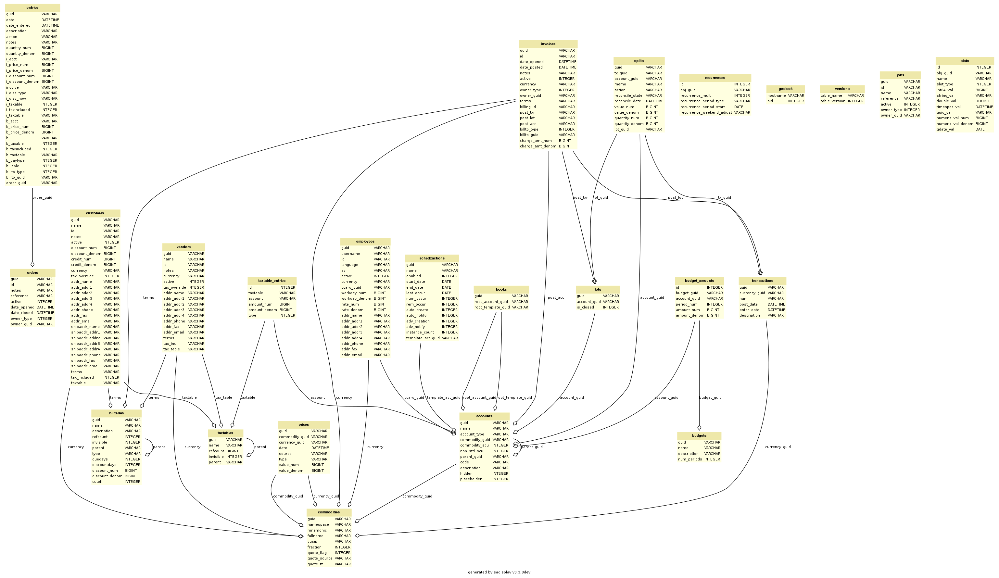

===================================
GnuCash SQL Object model and schema
===================================

A clear documentation of the SQL schema (tables, columns, relationships) and the implicit semantic (invariants that should
be always satisfied, logic to apply in ambiguous/corner cases) is critical for piecash to

 a) ensure data integrity (when creating new objects and/or modifying/deleting existing objects)
 b) ensure compatibility in semantic with the official GnuCash application

.. warning::

    This document explains what the author understands in these domains. It is not the reference documentation, please refer
    to the official GnuCash documentation for this.

.. warning::

    Disclaimer : piecash primary focus is on reading GnuCash books and creating new `Core objects`_.
    Creating other objects than the core objects, modifying existing objects attributes or relationships and deleting
    objects can be done through piecash but at the user's own risk (backup your books before doing any of such modifications)

Schema
======

The following SQL schema has been generated by sadisplay (https://pypi.python.org/pypi/sadisplay) on a GnuCash book
generated by piecash on the MySQL backend with the option keep_foreign_keys (the official GnuCash schema does not define
foreign keys):

Days, times, dates & datetimes
==============================

The use of date and time in GnuCash is somewhat complicated (mainly due to legacy reasons).
This chapter described how days and time are encoded in the different tables. For each table.field,
the DB type and the PIECASH type are given (DATE = day, DATETIME = day + time) as well as the representation
in SQL. All examples are based on a local time in CET (central european time) and for the 11 feb 2018.

prices.date
    | DATETIME -> DAY = YYYY-MM-DD 00:00:00 LT expressed as UTC (e.g. 20180210230000) if price entered via the price editor
    | DATETIME -> DAY = YYYY-MM-DD 10:59:00 UTC (e.g. 20180211105900) if price generated via a transaction
    | DATETIME -> DAY = ??? (To be completed)) if price retrieved via Finance:Quote

transactions.post_date
    DATETIME -> DAY = YYYY-MM-DD 10:59:00 UTC (e.g. 20180211105900)
    In the slots, the date-posted stores the post_date as a day (e.g. 20180211)

transactions.enter_date
    DATETIME -> DATETIME = YYYY-MM-DD hh:mm:ss UTC (e.g. 20180211123036)

splits.reconcile_date
    DATETIME -> DAY = 1970-01-01 00:00:00 UTC if not applicable (19700101000000)
    DATETIME -> DAY = YYYY-MM-DD 23:59:59 LT expressed as UTC (e.g. 20180211225959)
    In the slots, the reconcile-info/last-date stored and int64 representing the timestamp of the last post_date (e.g. 1518389999 ~ 20180211105900)

schedxactions.start_date, schedxactions.end_date, schedxactions.last_occur
    DAY -> DAY = YYYY-MM-DD

Core objects
============

There are 5 core objects in GnuCash  : `Book`_, `Commodity`_, `Account`_, `Transaction`_, `Split`_.
An additional object, the `Price`_, is strongly linked to the Commodity and is used in reports and for display (for instance, to convert all accounts balance
in the default currency). While not as core as the others, it is an essential piece of functionality for anyone using
GnuCash to track a stock portfolio value or multi-currency book.

.. note::

    A priori, all these objects are all "create once, never change" objects. Changing some fields of an object may lead to
    complex renormalisation procedures. Deleting some objects may lead to complex cascade changes/renormalisation procedures.
    In this respect, it is important to either avoid changes/deletions or to have clear invariants that should stay true at any time.

Book
----

The Book is the object model representing a GnuCash document. It has a link to the root account, the account at the
root of the tree structure.

Fields
~~~~~~
root_account (mandatory)
  The account at the root of the tree structure

root_template (mandatory)
  Use to attach split from template/scheduled transactions

Invariant
~~~~~~~~~
 - one (and only one) Book per GnuCash document

Commodity
---------

A Commodity is either a currency (€, $, ...) or a commodity/stock that can be stored in/traded through an Account.

The Commodity object is used in two different (but related) contexts.

 a) each Account should specify the Commodity it handles/stores. For usual accounts (Savings, Expenses, etc), the Commodity
    is a currency. For trading accounts, the Commodity is usually a stock (AMZN, etc).
    In this role, each commodity (be it a stock or a currency) can have Prices attached to it that give the value of the
    commodity expressed in a given currency.

 b) each Transaction should specify the Currency which is used to balance itself.

Fields
~~~~~~
namespace (mandatory)
  A string representing the group/class of the commodity. All commodities that are currencies should have 'CURRENCY' as
  namespace. Non currency commodities should have other groups.

mnemonic (mandatory)
  The symbol/stock sticker of the commodity (relevant for online download of quotes)

fullname
  The full name for the commodity. Besides the fullname, there is a "calculated property" unique_name equal to "namespace::mnemonic"

cusip
  unique code for the commodity

fraction
  The smallest unit that can be accounted for (for a currency, this is equivalent to the scu, the smallest currency unit)
  This is essentially used for a) display and b) roundings

quote_flag
  True if Prices for the commodity should be retrieved for the given stock. This is used by the "quote download" functionnality.

quote_source
  The source for online download of quotes

Invariant
~~~~~~~~~

 - a currency commodity has namespace=='CURRENCY'
 - only currencies referenced by accounts or commodities are stored in the table 'commodities' (the complete list of
   currencies is available within the GnuCash application)
 - a stock commodity has namespace!='CURRENCY'

Account
-------

An account tracks some commodity for some business purpose. Changes in the commodity amounts are modelled through Splits
(see Transaction & Splits).

Fields
~~~~~~

type (mandatory)
  the type of the account as string

commodity (mandatory)
  The commodity that is handled by the account

parent (almost mandatory)
  the parent account to which the account is attached. All accounts but the root_account should have a parent account.

commodity_scu (mandatory)
  The smallest currency/commodity unit is similar to the fraction of a commodity. It is the smallest amount of the commodity
  that is tracked in the account. If it is different than the fraction of the commodity to which the account is linked,
  the field non_std_scu is set to 1 (otherwise the latter is set to 0).

name
  self-explanatory

description
  self-explanatory

placeholder
  if True/1, the account cannot be involved in transactions through splits (ie it can only be the parent of other accounts).
  if False/0, the account can have Splits referring to it (as well as be the parent of other accounts).
  This field, if True, is also stored as a Slot under the key "placeholder" as a string "true".

hidden
  if True/1, the account will not be displayed in the GnuCash GUI Accounts tab and can be easily excluded from GnuCash GUI Reports.
  if False/0, the account will be displayed in the GnuCash GUI Accounts tab.

Invariant
~~~~~~~~~
 - if placeholder, no new splits can be created/changed (like a "freeze")
 - only two accounts can have type ROOT (the root_account and the root_template of the book).
 - the type of an account is constrained by the type of the parent account
 - trading account are used when the option "use trading accounts" is enabled

.. _Transaction:

.. _Split:

Transaction & Splits
--------------------

The transaction represents movement of money between accounts expressed in a given currency (the currency of the transaction).
The transaction is modelled through a set of Splits (2 or more).
Each Split is linked to an Account and gives the increase/decrease in units of the account commodity (quantity)
related to the transaction as well as the equivalent amount in currency (value).
For a given transaction, the sum of the split expressed in the currency (value) should be balanced.

Fields for Transaction
~~~~~~~~~~~~~~~~~~~~~~
currency (mandatory)
  The currency of the transaction

num (optional)
  A transaction number (only used for information)

post_date (mandatory)
  self-explanatory. This field is also stored as a slot under the date-posted key (as a date instead of a time)

enter_date (mandatory)
  self-explanatory

description (mandatory)
  self-explanatory

Fields for Split
~~~~~~~~~~~~~~~~
tx (mandatory)
  the transaction of the split

account (mandatory)
  the account to which the split refers to

value (mandatory)
  the value of the split expressed in the currency of the transaction

quantity (mandatory)
  the change in quantity of the account expressed in the commodity of the account

reconcile information
  (Descriptions from official help manual.)

  - n - Default status when a transaction is created
  - c - Cleared. Status may be assigned either manually or by an import process.
  - y - Status assigned solely by the reconciliation process. Places limits optionally requiring confirmation on editing fields in that line of a transaction.
  - f - Frozen. Not implemented at this time
  - v - Voided. Status is assigned or released manually and applies to every line in the transaction. It hides most of the transaction details but does not delete them. When a transaction is voided a reason entry is required that appears to the right of the description. (Note: There appears to be no way to actually view the reason in the GnuCash GUI at the moment.)

lot
  reference to the lot (to be investigated)

Invariant
~~~~~~~~~

 - the sum of the value on all splits in a transaction should = 0 (transaction is balanced). If it is not the case, the
   GnuCash application create automatically an extra Split entry towards the Account Imbalance-XXX (with XXX the currency
   of the transaction)
 - the value and quantity fields are expressed as numerator / denominator. The denominator of the value should be
   the same as the fraction of the currency. The denominator of the quantity should be the same as the commodity_scu of
   the account.
 - the currency of a transaction is the currency of the account into which it is created in the GUI
 - if "use trading accounts" is enabled then the sum of quantities per commodity should also be balanced. This is done thanks
   to the automatic creation of splits with trading accounts (of type TRADING)
 - the reconcile field in all splits in a transaction that is voided are set to v
 - a voided transaction has 4 associated slots with obj_guid equal to the transaction's guid and slot_type 4:

   + name: notes, string_val: Voided transaction
   + name: trans-read-only, string_val: Transaction Voided
   + name: void-reason, string_val: <user-supplied reason string>
   + name: void-time, string_val: date as string in format ``YYYY-MM-DD HH:mm:ss.nnnnnn pZZZZ`` where n represents milliseconds, p is an optionally present minus sign, and ZZZZ is GMT offset in HHmm format.
 - a voided split has 2 nearly identical associated slots with obj_guid equal to the split's guid and slot_type 3:

   + name: void-former-amount, numeric_val_num/numeric_val_denom: the value of the voided split
   + name: void-former-value, numeric_val_num/numeric_val_denom: the value of the voided split

Price
-----

The Price represent the value of a commodity in a given currency at some time.

It is used for exchange rates and stock valuation.

Fields
~~~~~~
commodity (mandatory)
  the commodity related to the Price

currency (mandatory)
  The currency of the Price

date (mandatory)
  self-explanatory (expressed in UTC)

value (mandatory)
  the value in currency of the commodity

Invariant
~~~~~~~~~

 - the value is expressed as numerator / denominator. The denominator of the value should be
   the same as the fraction of the currency.
